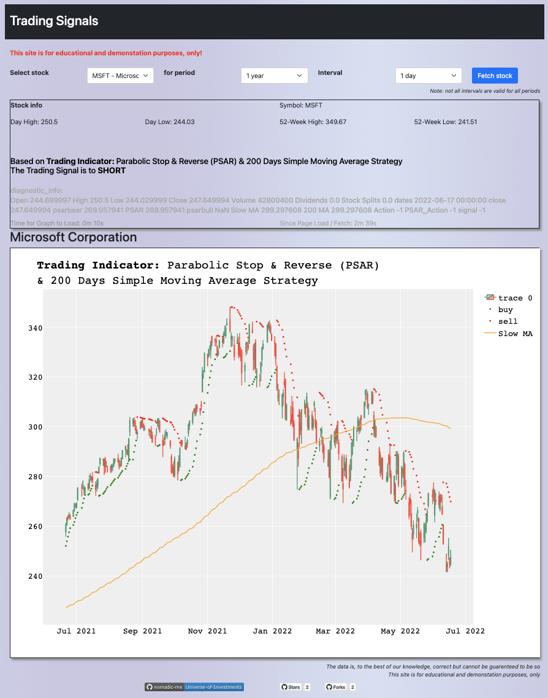

# Universe-of-Investments

## What is the project about:

- [What: The Purpose](Purpose.md)
- [How: The Logic](Logic.md)
- [Who: The Team](Team.md)
- [Python Prerequsites](PythonPrerequsites.md)

## But... Where is the Code?

Majority of the "Active Ingredients" are here: 
- The Backend Code: Serving the Web Requests via Flask: 
    - [app/routes.py](app/routes.py)  
- The Frontend Code: Serving the HTML5 and Javascript Code via Flask Templates 
    - [app/templates/stock.html](app/templates/stock.html)

## Ok, But... Where is the ML Code?
- Machine learning code to show returns are in the Jupyter Lab
    - [JupyterNotebook/Technical_indicators_Swing_Trading.ipynb](JupyterNotebook/Technical_indicators_Swing_Trading.ipynb)

## Future Roadmap:
Develop IBKR TWS API Access to Trading Signals
- [Interactive Brokers - Trade Workstation (TWS) - API Access](IBKR-TWS-API.md)

]
## References:

- [Stochastics: An Accurate Buy and Sell Indicator](https://www.investopedia.com/articles/technical/073001.asp)
