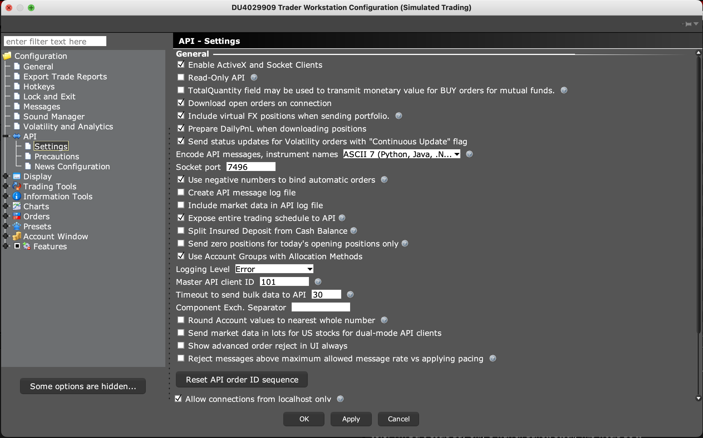

# Universe-of-Investments
Fintech Project 2

## 1. Prerequsites

### 1.1 Install the prerequsites in your Python / Conda Environment For Technical Analysis and Financial Data
```shell
pip install pandas_ta
pip install yfinance
pip install mplfinance
conda install -c conda-forge ta-lib
```

### 1.2 Follow the next steps to install PyViz and all its dependencies in your Python virtual environment.

1. Download the PyViz dependencies **nodejs** and **npm** (included in nodejs).

    ```shell
    conda install -c conda-forge nodejs=12 -y
    ```

2. Use the `conda install` command to install the following packages. Note: On some of these installs, you may get a message that says that the requested packages are already installed. That is fine. Conda is really good at installing all of the required dependencies between these tools.

    ```shell
    conda install -c pyviz holoviz -y
    conda install -c plotly plotly -y
    conda install -c conda-forge jupyterlab=2.2 -y
    ```

3. Use pip to install the correct versions of `matplotlib` and `numpy` using the following commands:

  ```shell
  pip install numpy==1.19
  pip install matplotlib==3.0.3
  ```

4. PyViz installation also requires the installation of Jupyter Lab extensions. These extensions are used to render PyViz plots in Jupyter Lab. Execute the below commands to install the necessary Jupyter Lab extensions for PyViz and Plotly Express. 

    * **IMPORTANT:** _In some installation cases you may encounter the following warning. If you do, **continue with the installations as indicated**, as this warning will **not** affect your code._

      ```
      Config option `kernel_spec_manager_class` not recognized by `EnableNBExtensionApp`
      ```

    * Set `NODE_OPTIONS` to prevent "JavaScript heap out of memory" errors during extension installation:

      ```shell
      # (OS X/Linux)
      export NODE_OPTIONS=--max-old-space-size=4096

      # (Windows)
      set NODE_OPTIONS=--max-old-space-size=4096
      ```

    * Install the Jupyter Lab extensions: 

      ```shell
      jupyter labextension install @jupyter-widgets/jupyterlab-manager --no-build

      jupyter labextension install jupyterlab-plotly --no-build

      jupyter labextension install plotlywidget --no-build

      jupyter labextension install @pyviz/jupyterlab_pyviz --no-build
      ```

    * Build the extensions (This may take a few minutes):

      ```shell
      jupyter lab build
      ```
    
    * Using the `build` and `--no-build` flags allows the machine to build all four extensions simultaneously, otherwise you will have to wait several minutes in between in each installation.
        
    * After the build, unset the node options that you used above:

      ```shell
      # Unset NODE_OPTIONS environment variable
      # (OS X/Linux)
      unset NODE_OPTIONS

      # (Windows)
      set NODE_OPTIONS=
      ```

5. Run the following commands to confirm installation of all PyViz packages. Look for version numbers with at least the following versions.  

      ```shell
      conda list nodejs
      conda list holoviz
      conda list hvplot
      conda list panel
      conda list plotly
      ```

      ```text
      nodejs                    12.0.0
      holoviz                   0.11.3
      hvplot                    0.7.1
      panel                     0.10.3
      plotly                    4.14.3
      numpy                     1.19
      matplotlib                3.0.3
      ```

### 1.3 Install the Interactive Brokers TWS API related Python packages
```shell
pip install ibapi
pip install ib_insync
pip install nest_asyncio

```


### 1.4 Sign up for an IBKR Paper Trading Account
[How to Sign Up for an Interactive Brokers Paper Trading Account](https://algotrading101.com/learn/interactive-brokers-paper-trading-demo/)


### 1.5 Configure IBKR Trade Workstation API



## References:

- https://ib-insync.readthedocs.io/index.html
  - Library to make working with Interactive Broker TWS API easier using linear style of programming;
- https://github.com/erdewit/nest_asyncio
  - This fixes the "RuntimeError: This event loop is already running".
