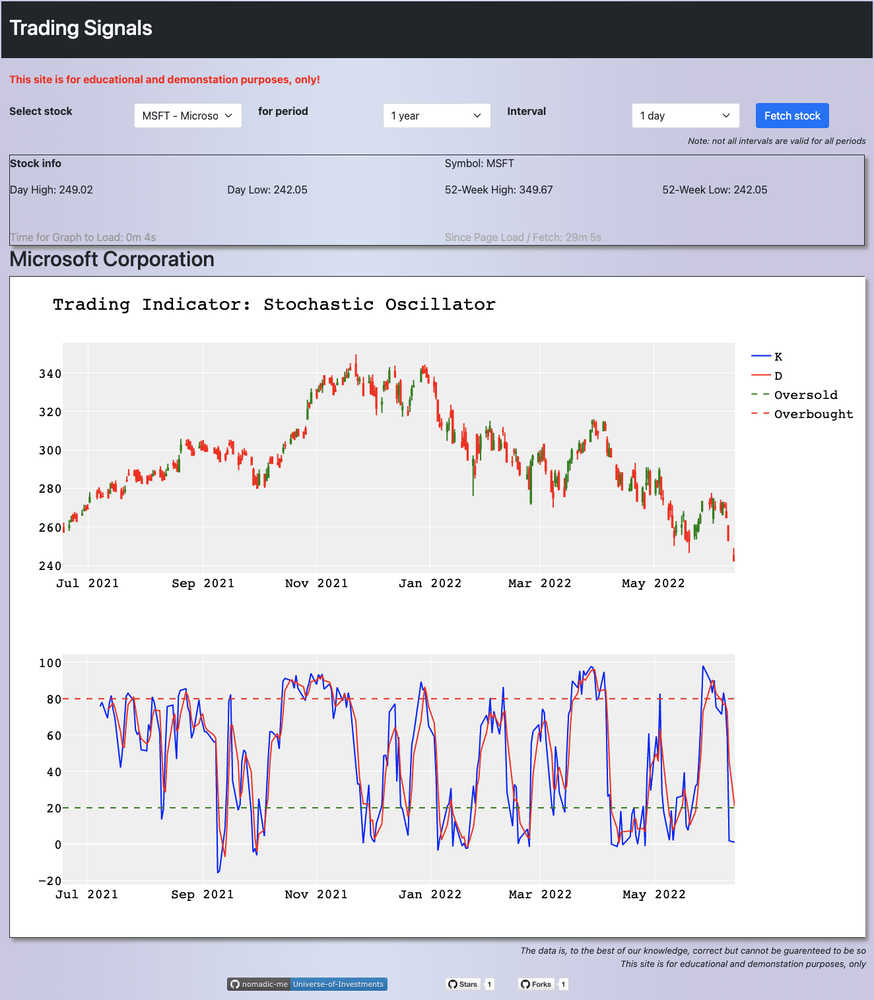

# Universe-of-Investments

Fintech Project 2

- [What: The Purpose](Purpose.md)
- [How: The Logic](Logic.md)
- [Who: The Team](Team.md)
- [Python Prerequsites](PythonPrerequsites.md)
- [Interactive Brokers - Trade Workstation (TWS) - API Access](IBKR-TWS-API.md)

]
## References:

- [Stochastics: An Accurate Buy and Sell Indicator](https://www.investopedia.com/articles/technical/073001.asp)
